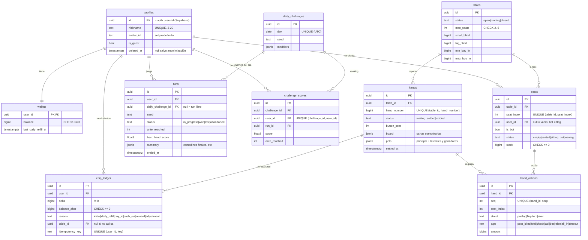
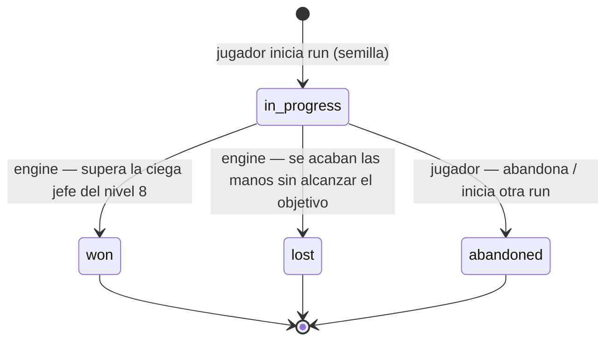
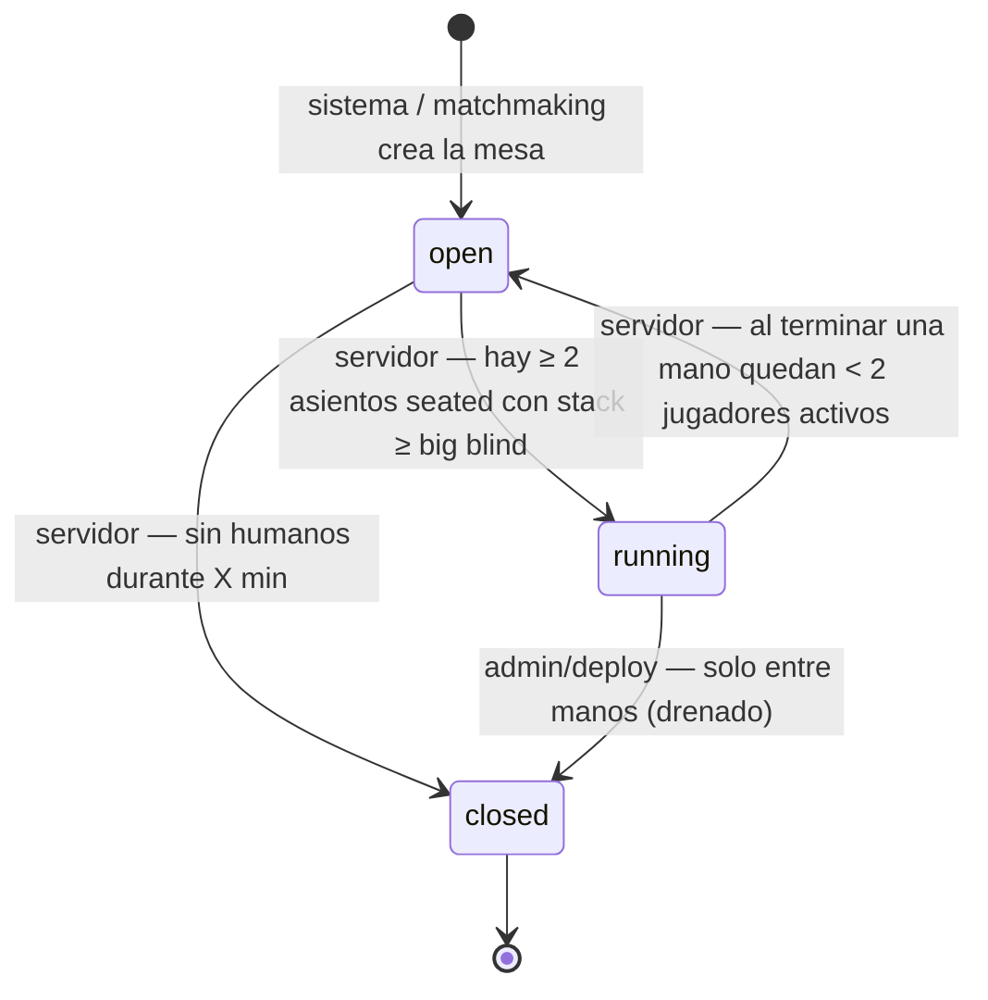
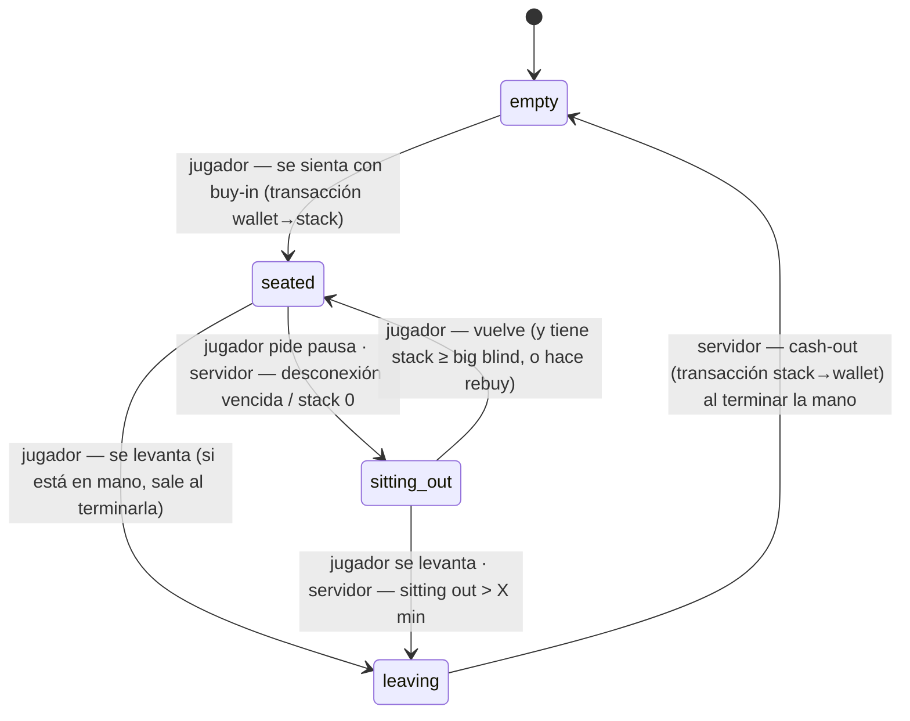
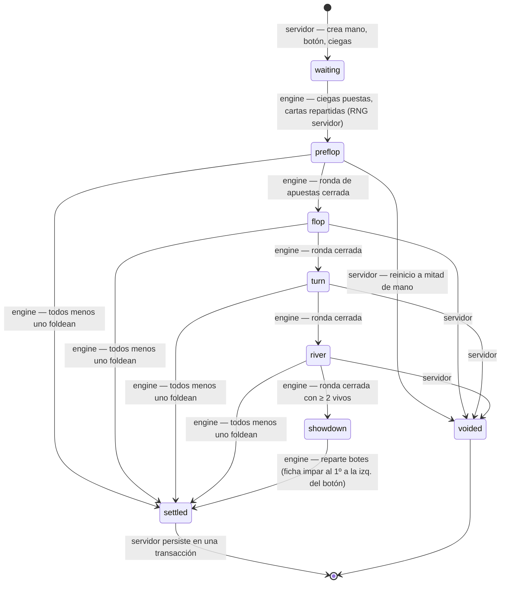

# Modelo de dominio (borrador Fase 0)

Convenciones: PK `uuid` (v7 generado en la app), `created_at`/`updated_at` `timestamptz` en todas las tablas, FKs con índice, fichas en `bigint`.

## ERD

Notas:
- La run del roguelike **en curso** vive en el teléfono (expo-sqlite). `runs` en el servidor guarda solo el resultado al terminar (para el desafío diario e historial), cuando hay red. Validar puntajes del desafío diario reproduciendo semilla + acciones en el servidor es posible gracias al engine determinista; decidir en la fase del desafío si se envía el log de acciones.
- Las cartas privadas de `hand_actions`/`hands` solo se persisten tras liquidar (`jsonb` de hole cards en `hands`, visible solo para historial propio o tras showdown).
- `hands.status` incluye `voided` para manos anuladas por reinicio (ADR 0004). No figuraba en CLAUDE.md: propuesta.

## Estados

### Run (cliente; se sube al terminar)

### Table (servidor)

### Seat (servidor)

### Hand (engine; el servidor la avanza)

Con all-in de todos los vivos, el engine reparte las calles restantes sin rondas de apuestas (sigue pasando por flop/turn/river).
